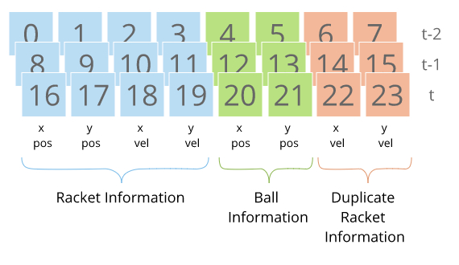
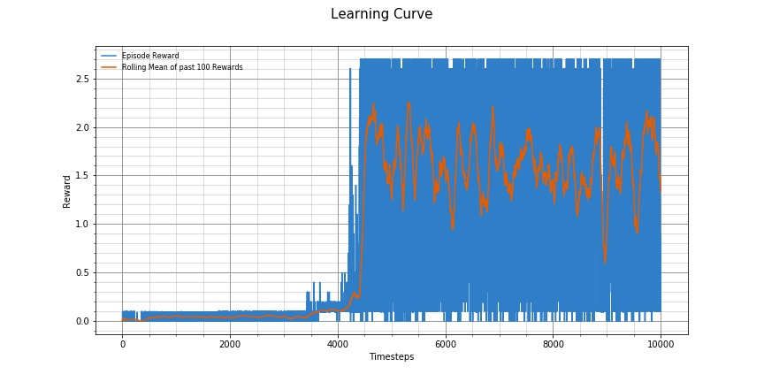

# Reinforcement Learning in a Multi Agent Cooperative Environment

The aim of this project is to use Reinforcement Learning to work on an environment that contains multiple agents whose task is to cooperate with each other to achieve a common goal.

## Environment

The environment used for this project is a variant of the  [Tennis Environment](https://github.com/Unity-Technologies/ml-agents/blob/master/docs/Learning-Environment-Examples.md#tennis) agent by Unity.

The environment consists of two agents controlling tennis rackets. The aim for each agent is to hit the ball over the net, on to the other agents side of the court, and colaborate with each other to prevent the ball from hitting the floor or going out of bounds for as long as possible.

The available *state-space* for each agent consists of a vector with 24 variables. This consists of 8 values encoding racket and ball information for the current step, and previous 2 timesteps. Notice that there is actually some duplicate racket information values. Having information over multiple timesteps allows the agent to have information about the movement of objects in the environment.




Due to the duplication of data, and the fact that some motion data is already encoded in the individual variables, only a subset of this data is used as inputs to the model trained in this project. The sate is preprocessed to only contain the following indices:

```
[3,4,5,11,12,13,16,17,18,19,20,21]
```

This only includes the racket position and velocity of the current timestep, and the y-velocity of the racket over the previous timesteps (this gives the agent knowledge about acceleration in y direction which is useful for calculating when the *jump* action can be taken). It also includes all the ball position information over the three timesteps to give the agent knowledge about the movement of the ball.


The *action-space* for each agent are two continuous variables:

1. Amount of movement in x axis (towards/away from net)
2. Amount to jump by

A reward of +0.1 is given to an agent if it hits the ball over the net, and within bounds of the court. It receives a reward of -0.01 if it lets the ball hit the ground or hits the ball out of bounds.

For each episode, the rewards for each agent are added up (without discounting), and the maximum of the two is given as the score of the episode. The task is considered solved if the rolling average score over the past 100 timesteps is at least +0.5.


## Learning Algorithm

The learning algorithm used to solve this project is an implementation of the Multi-Agent Deep Deterministic Policy Gradient (MADDPG) method introduced by [Lowe et al. (2018)](https://arxiv.org/abs/1706.02275). This is itself an extension of the Deep Deterministic Policy Gradient (DDPG) method ([Lillicrap et al (2015)](https://arxiv.org/abs/1509.02971)), adapted to deal with instability issues when training in an environment with multiple agents.

The way it deals with the instability isues, is in what it feeds to the critic network. Just like other actor-critic algorithms, including DDPG, the MADDPG algorithm makes use of separate *actor* and *critic* networks for each agent. The difference is that while the actor only makes use of its observations, the critic also makes use of the observations of all the other agents in the environment during training. However, importantly, when making decisions about what actions to take, the agent still only has access to its own observations.

The actor network is composed of fully connected layers, as follows, taking the agents processed observations of size 12, and returning an output of size 2, representing the two actions to be taken.

```
input(12) -> FC(256) > RELU > FC(128) > RELU > FC(2) > Tanh
```

Where:

- `FC(n)` represents a fully connected layer with `n` output neurons.
- `RELU` represents the Rectified Linear Unit activation function
- `Tanh` represents the Tanh activation function

The critic network contains the following structure, taking a processed vector of all agent's observations and actions, and returning an output of size 1, representing the estimated Q value.

```
input(22) -> FC(256) > RELU > FC(128) > RELU > FC(1)
```

In order to encourage exploration in the early stages of training, Ornstein–Uhlenbeck Noise is added to the predicted actions. The noise uses a scale factor of `2` for the first 500 steps of interactions with the environment, and then rapidly decayed by multiplying by `0.995` for each subsequent interaction step. The resulting value is then clipped to the range of `-1` to `1` inclusive.


The following describes the steps involved in the MMADPG algorithm

1. Create a queue `buffer` to store experience tuples
2. FOR each agent:
    - local critic network `local_critic` initialized with random weights `local_critic.weights`  # Q , θ
    - local actor network `local_actor` with random weights  `local_actor.weights` # μ, φ
    - target critic network `target_critic` initalized to same weights as `local_critic` (`target_critic.weights = local_critic.weights`
    - target actor network `target_actor` initalized to same weights as `local_actor` (`target_actor.weights = local_actor.weights`

3. FOR each episode:
    - reset the environment and get initial `states` for each agent
    - preprocess the `states`, and generate the `global_states` which concatenate information about the observations of each agent.
    - FOR each `step` in episode:
        - Feed the `states` to the `local_actor` network of each agent, to get `actions` in return. Add some random Ornstein–Uhlenbeck noise scaled by a factor of `noise` to the actions (`actions = actions + OUNoise(noise)`) to encourage exploration, and clip the values to be between `-1` and `1` (inclusive)
        - Interact with the environment using `actions` and get as feedback the (`new_states`, `rewards`, and `dones`)
        - Preprocess the `next_states`, and generate the `next_global_states`
        - Add the (`states`, `global_states`, `actions`, `rewards`, `next_states`, `next_global_states`, `dones`) to the `buffer`
        - IF there is enough samples in the `buffer` to take batches of experiences, take a random sample of `experiences` from the `buffer`
            - FOR each agent
                - UPDATE critic network:
                    - Concatenate the `global_states` and `actions`, and feed them to the correspodning `local_critic` network, to get the `q` value, representing the estimate of future rewards from current state.
                    - Feed the batch of `next_states` to the `target_actor` network to get the `target_actions`
                    - Concatenate the batch of `next_global_states` to the `target_actions` and feed this to the correspodning `target_critic`, to get the `q_next` value, representing the estimate of future rewards from the next state onwards.
                    - Calculate the label `y` as current `rewards` plus discounted returns of future returns (`y =  rewards + DISCOUNT_FACTOR * q_next`) if it is not the final step in the episode, else calculate the label `y` as the current `rewards` (`y = rewards`)
                    - Calculate `critic_loss` as the huber loss using `(y, q)` as inputs
                    - Perform gradient descent to update the critic network's weights
                - UPDATE actor network
                    - For each `agent`, feed the corresponding batch of `states` to the corresponding `local_actor` to get a list of `actor_actions` for each agent.
                    - concatenate the batch of `global_states` and `actor_actions` for each agent and feed this to the curent agent's `local_critic` network to get a batch of `q` values.
                    - Calculate `actor_loss` as the negative of the mean of `q` values (`actor_loss = -mean(q)`)
                    - Perform gradient descent to update the actor network's weights

            - Perform a soft update of the `target_critic.weights`, moving them closer to `local_critic.weights` by a factor of `TAU`
            - Perform a soft update of the `target_actor.weights`, moving them closer to `local_actor.weights` by a factor of `TAU`


Some hyperparameters used in the trained agent in this project are:

```
TAU = 0.02                # For soft updates of target network get updated by
DISCOUNT_FACTOR = 0.95    # For discounted rewards
LR_ACTOR = 1e-3           # Learning rate for actor networks
LR_CRITIC = 1e-3          # Learning rate for critic networks

N_BATCHES_PER_UPDATE = 4  # How many batches of samples to take when updating

BATCH_SIZE = 1024         # How many samples to take from buffer with each update
BUFFER_SIZE = 100000      # Max size of experience replay buffer
```


# Results

The model was able to solve the environment (achieve a rolling average score of at least 0.5 ove the last 100 timesteps ) in 4429 episodes. The model was left to train further, achieving a peak rolling average score of 2.2529000335745515 at episode number 5311.

The trained agent can be observed in [this video](https://youtu.be/QlFzNOmSnn8).




# Future Work

There is a lot of instability in the performace of the model. Even though the rolling average score is quite good, this fluctuates quite a lot between each subsequent training step. I would be good to experiment with what kinds of settings would make it more stable.

There is also a very long period of about the first 3500 steps where one of the agents is not learning , preventing the model from getting better than a 0.1 score. It takes a long time to break out of its bad habbits. It would be good to look for ways of improving this so the model trains quicker over all.
